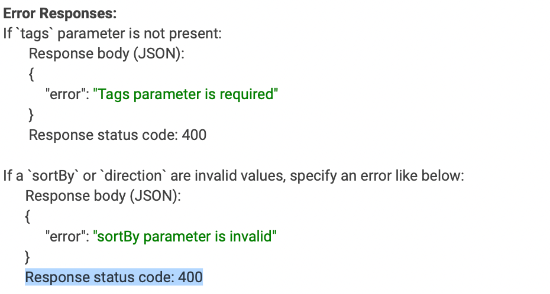
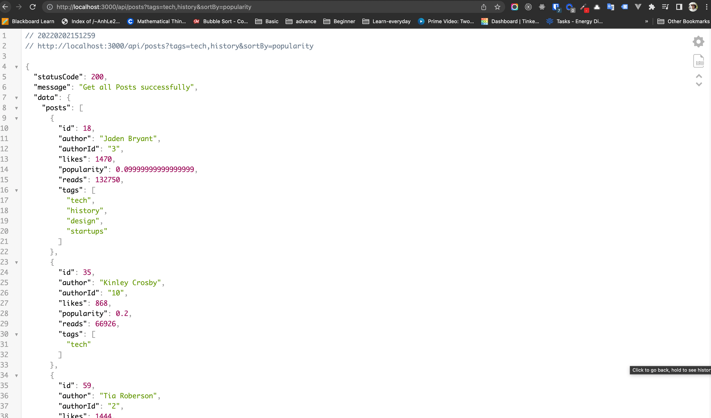
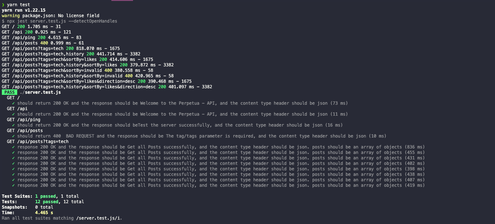

# Junior Online Assignment

## Working application

# [Live Post link](https://perpetua.herokuapp.com/api/posts?tags=tech)

### Rout 1


### Rout 2


## 1. Introduction

In this assessment, you will write a simple backend JSON API. You will be building an API that requires you to fetch data from this API:


## 2. Requirements

1. The API response will be a list of all the blog posts that have at least one tag specified in the tags parameter.
2. The sortBy parameter specifies which field should be used to sort the returned results. This is an optional parameter, with a default value of `id`.
3. The direction parameter specifies if the results should be returned in ascending order (if the value is "asc") or descending order (if the value is "desc"). The default value of the direction parameter is `asc`.
4. Combine all the results from the API requests above and remove all the repeated
   posts (try to be efficient when doing this)
5. For every tag specified in the tags parameter, fetch the posts with that tag using
   the Hatchways API (make a separate API request for every tag specified)
6. Test the API with the following main test cases:

- show the `{success: true} Response status code: 200`
- show the Error responses
  

## 3. Results:

1. requirement 1, 2, 3, 4:
   
2. Requirement other 4:
   

3. Requirement 5 tags=tech,history&sortBy=popularity:

  
4. Requirement 4 tags=tech,history&sortBy=popularity&direction=desc:
 

5. Requirement 5:
   
6. Requirement 6:
   

## 4. How to run

```js
  Install Node.js and npm
  yarn
  yarn start
```

## 5. How to test

1. Comment lines 18, 19, 20 in server.js

```js
app.listen(PORT, () => {
  console.log('Server is running on port', 3000);
});
```

2. run test command:

```js
yarn test
```

## 7 Structure of the project:

```
.
project
│   README.md
│   HowToDo.md
│   routeCache.j
│   server.js
│   server.test.js
└───api
│   │   baseApi.txt
│   │   getPosts.txt
│
└───config
│   │   environment.js
│   │   file022.txt
│
└───constants
│   │   status.constants.js
│
└───controllers
│   │   postsController.js
│   │   testServerCtrl.js
│
└───requirements
│   │   feedback-sample.png
│   │   requirement.pdf
│   │
│   └───images
│
└───routes
│   │   index.js
│   │
│   └───posts
│   │   │   index.js
│   │   │   posts.js
│   └───testServer
│   │   │   index.js
│   │   │   testServer.js
│
└───utils
│   │   response.js
│   │   logger.js
```
